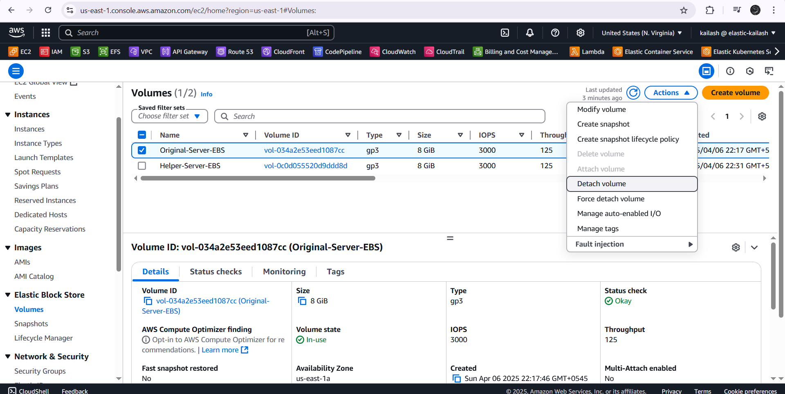
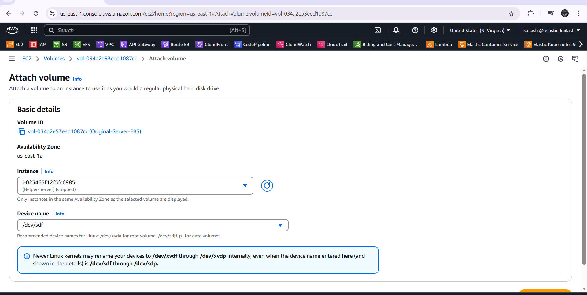
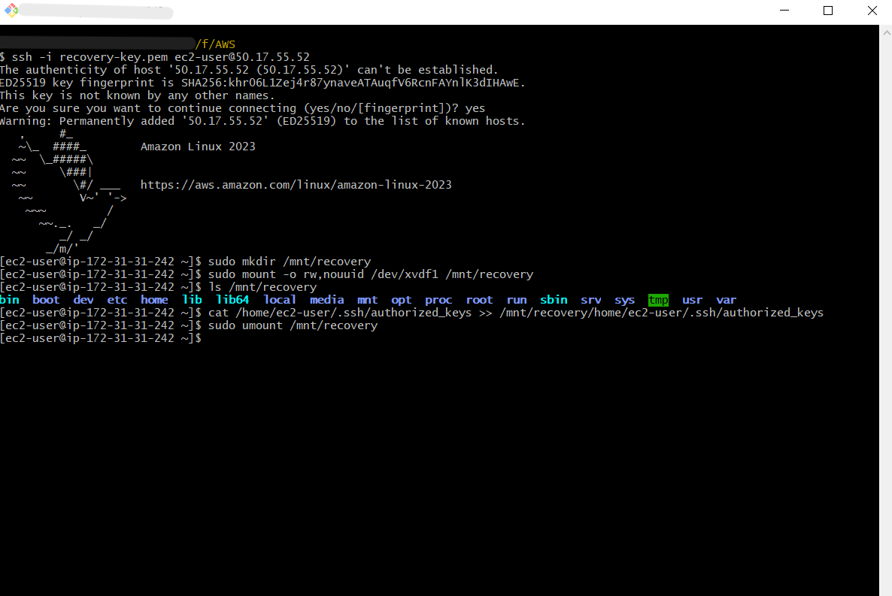
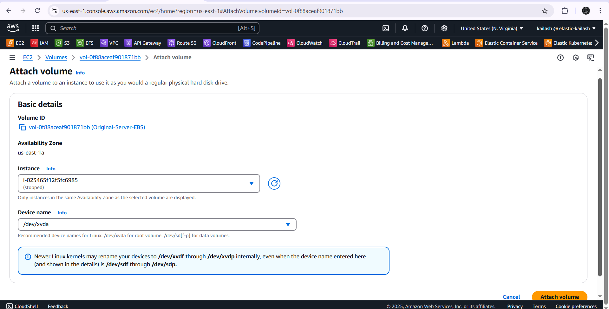
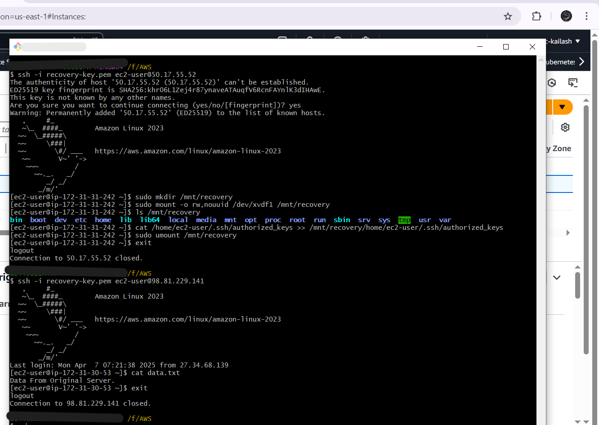

# 🔐 Recovering Lost SSH Key for an EC2 Instance

## 📝 Summary

You're managing an EC2 instance and accidentally **lose your SSH key**. Terminating the instance is not an option. This guide will walk you through **recovering access** by attaching the root volume to a helper instance, updating the `authorized_keys`, and restoring access — **all via the AWS Console**.

---

## 📚 Table of Contents

1. [📘 Summary](#-Summary)  
2. [🛡️ Prerequisites](#️-prerequisites)  
3. [🖥️ Step-by-Step Guide](#️-step-by-step-guide)  
    - [🔹 Step 1: Stop the Affected EC2 Instance](#-step-1-stop-the-affected-ec2-instance)  
    - [🔹 Step 2: Detach the Root Volume](#-step-2-detach-the-root-volume)  
    - [🔹 Step 3: Attach Volume to Helper Instance](#-step-3-attach-volume-to-helper-instance)  
    - [🔹 Step 4: Modify the `authorized_keys` File](#-step-4-modify-the-authorized_keys-file)  
    - [🔹 Step 5: Detach and Reattach the Volume Back](#-step-5-detach-and-reattach-the-volume-back)  
    - [🔹 Step 6: Start the Original EC2 Instance](#-step-6-start-the-original-ec2-instance)  
4. [✅ Validation](#-validation)  
5. [🧠 Key Learnings](#-key-learnings)  
6. [📸 Screenshots (Evidence)](#-screenshots-evidence)

---

## 🛡️ Prerequisites

- A running **helper EC2 instance** in the same Availability Zone (AZ).
- A **working key pair** (e.g., `recovery-key.pem`) to connect to the helper instance.
- **IAM permissions** to manage EC2, EBS, and SSH access.
- Familiarity with **AWS Console** and **basic Linux commands**.

---

## 🖥️ Step-by-Step Guide

---

### 🔹 Step 1: Stop the Affected EC2 Instance

- Go to **EC2 > Instances**.
- Select your affected instance.
- Choose **Actions > Instance State > Stop**.

---

### 🔹 Step 2: Detach the Root Volume

- Navigate to **EC2 > Elastic Block Store > Volumes**.
- Find the root volume (`/dev/xvda`) of the stopped instance.
- Select it and click **Actions > Detach Volume**.

---

### 🔹 Step 3: Attach Volume to Helper Instance

- Select the **detached volume**.
- Click **Actions > Attach Volume**.
- Choose the **helper instance** and set the device name (e.g., `/dev/sdf`).
- Click **Attach**.

> Note: `/dev/sdf` may appear as `/dev/xvdf` inside the instance.

---

### 🔹 Step 4: Modify the `authorized_keys` File

#### ✅ Connect to Helper Instance

```bash
ssh -i recovery-key.pem ec2-user@<helper-instance-public-ip>
```

#### ✅ Mount the volume

```bash
sudo mkdir /mnt/recovery
sudo mount -o rw,nouuid /dev/xvdf1 /mnt/recovery
```

#### ✅ Validate mount

```bash
ls /mnt/recovery
```

You should see the usual Linux directories like `/home`, `/etc`, `/var`, etc.

#### ✅ Inject a valid public key

```bash
cat /home/ec2-user/.ssh/authorized_keys >> /mnt/recovery/home/ec2-user/.ssh/authorized_keys
```

> ✅ Alternatively, you can `echo "<your-public-key>" > authorized_keys` if needed.

#### ✅ Unmount the volume

```bash
sudo umount /mnt/recovery
```

---

### 🔹 Step 5: Detach and Reattach the Volume Back

- Detach the volume from the helper instance via **EC2 > Volumes**.
- Reattach it to the **original EC2 instance** as `/dev/xvda`.

---

### 🔹 Step 6: Start the Original EC2 Instance

- Navigate to **EC2 > Instances**.
- Select the original instance.
- Click **Actions > Instance State > Start**.

---

## ✅ Validation

Use your **new SSH key** to access the recovered EC2 instance:

```bash
ssh -i recovery-key.pem ec2-user@<original-instance-public-ip>
```

**OR** if you used a different key:

```bash
ssh -i <your-new-key.pem> ec2-user@<original-instance-public-ip>
```

If you successfully connect to the instance without errors, then 🎉 **Congratulations! You’ve successfully recovered access to your EC2 instance without data loss.**

---

## 🧠 Key Learnings

- Recovering access without losing EC2 instance or data.
- Safely working with **EBS volumes and mounts**.
- How to edit **Linux `authorized_keys`** securely.
- Critical understanding of **volume attachment** and **recovery workflows**.

---

## 📸 Screenshots (Evidence)

#### 1. **Stopped Original EC2 Instance**  

  
*This screenshot shows the EC2 instance stopped in the AWS Management Console.*

---

#### 2. **Detached Root Volume**  
  
*This screenshot shows the root volume detached from the original EC2 instance.*

---

#### 3. **Volume Attached to Helper EC2 Instance**  
  
*This screenshot shows the root volume successfully attached to the helper EC2 instance in the AWS Console.*

---

#### 4. **Mounted and Edited authorized_keys**  
  
*This screenshot shows the volume mounted and the `authorized_keys` file being edited on the mounted volume.*

---

#### 5. **Volume Reattached to Original Instance**  
  
*This screenshot shows the root volume being reattached to the original EC2 instance.*

---

#### 6. **SSH Access Restored Successfully**  
  
*This screenshot shows successful SSH access restored using the new key to the original EC2 instance.*

---
